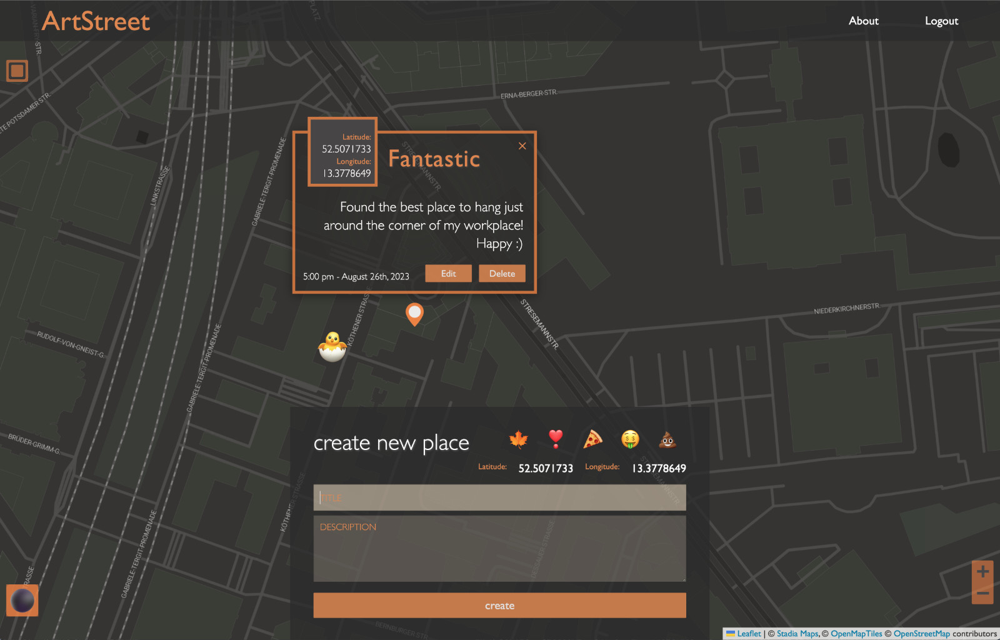

## ArtStreet



ArtStreet is a web application that let users pin special places on a map based on their current position.
It aims to become a location based diary or notebook. Work in progress.

### Use the App

To get started with ArtStreet, follow these instructions:

1. Fork this repo and clone it in to your local environment.

2. Navigate to the project folder and run.

```
npm install
```

3. Create a new file named .env in the root directory and populate it with your mongodb database connection string. 
```
DB_CONNECTION_STRING=something_url
```

4. Navigate to the server folder and run:
```
npm start
```

5. Navigate to the client folder and run:
```
npm start
```

### Technologies

Mongo, React, Express, Node